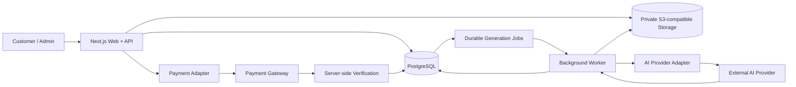

# AI Photo Template Platform — AI Product, Payments & Durable Generation

## Overview

AI Photo Template Platform is a template-first AI image product designed to turn generative-image capabilities into a controlled customer workflow rather than a prompt playground. Customers select a prepared template, provide the required photo set, review the generated result, and complete payment through a structured product flow.

The project is intentionally designed around reliability, privacy, recoverability, and operational control. The underlying source repository remains private; this case study documents the product and delivery patterns without exposing proprietary code, credentials, provider secrets, or customer data.

## Problem

Consumer AI image products often look simple at the interface level but become operationally complex once real payments, private media, provider failures, retries, duplicate callbacks, and generation costs are involved.

The product therefore needed to solve several problems at the same time:

- keep customer media private,
- preserve a reproducible template and order snapshot,
- avoid duplicate generation or duplicate payment effects,
- survive worker or provider failures,
- support provider retries without losing auditability,
- prevent unpaid access to final generated assets,
- keep production configuration fail-closed,
- provide operational recovery paths before a controlled pilot.

## My Role

I worked across product definition, technical delivery, reliability, and pilot-readiness activities, including:

- defining the template-first product model and customer journey,
- translating commercial rules into explicit order and payment states,
- coordinating architecture and implementation priorities,
- reviewing provider, payment, retry, recovery, and private-asset behavior,
- defining acceptance criteria for launch gates,
- testing failure modes and replay scenarios,
- documenting operational runbooks and pilot controls,
- keeping scope disciplined around a controlled rollout.

## Solution

The platform uses a modular product architecture with a web/API process and a durable background generation worker.

Key capabilities include:

- immutable template and order snapshots,
- private S3-compatible media storage,
- identity-bound orders and private result access,
- durable generation jobs with leases, retries, and recovery,
- provider adapters for AI image generation,
- payment-provider integration and verified receipts,
- replay protection and idempotent settlement behavior,
- admin-controlled template QA and publishing gates,
- controlled pilot sessions and abuse controls,
- health, readiness, backup, and launch-preflight tooling.

## Technology

The implementation has used:

- **Next.js** and React,
- **TypeScript**,
- **PostgreSQL**,
- **Drizzle ORM**,
- private S3-compatible object storage,
- background worker processing,
- AI image-provider APIs,
- payment-provider APIs,
- automated tests and CI quality gates.

## Architecture Snapshot

This sanitized view shows the main runtime boundaries without exposing provider secrets, internal endpoints, or customer data.

## Reliability Patterns

### 1. Durable generation instead of request-bound generation

Generation work is not treated as a single fragile web request. Jobs are persisted so the system can reason about retries, uncertainty, worker interruption, and recovery.

### 2. Provider isolation

AI and payment providers sit behind explicit adapters. This keeps provider-specific behavior separate from the core product state model and makes failure handling easier to test.

### 3. Payment and entitlement separation

A browser redirect alone never establishes entitlement. Payment must be verified server-side against the frozen order amount before paid access or downstream state changes are accepted.

### 4. Private-media controls

Customer inputs and generated results are treated as private assets. Access is time-limited and identity-bound rather than exposed as permanent public URLs.

### 5. Fail-closed production configuration

Production startup and launch checks reject missing, placeholder, repeated, or incompatible configuration instead of silently degrading into unsafe defaults.

## Validation & Current Status

The project progressed through architecture, catalog, private assets, identity-bound orders, durable generation, payment integration, AI-provider integration, admin QA, pre-pilot hardening, and controlled launch-gate work.

Validation work includes deterministic tests for:

- order ownership and idempotency,
- generation admission and recovery,
- provider retries and duplicate callbacks,
- payment verification and replay behavior,
- private-asset access rules,
- publication and QA invariants,
- production configuration and launch gates.

Real paid-provider and production-infrastructure evidence is kept separate from deterministic CI evidence and is not overstated in this portfolio.

## What This Demonstrates

This project demonstrates practical experience relevant to:

- AI product implementation,
- technical product operations,
- API and provider integration,
- payment and workflow reliability,
- background-job design,
- production readiness and pilot operations,
- failure-mode testing and recovery planning.

## Confidentiality Note

This is a sanitized case study. The private repository, proprietary implementation details, credentials, customer media, payment secrets, signed URLs, and production data are not published.